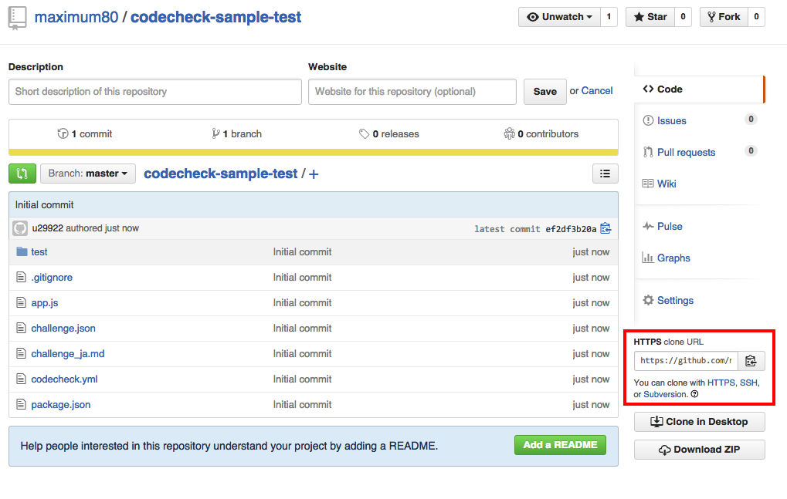

# How to use ChallengeViewer
See [Japanese version](challenge-viewer_ja.md)

## <a name="section1"> 1. How to use ChallengeViewer
### 1-1. Edit files
#### Type of files
  
You can see file tree on the left side of ChallengeViewer.  
And you can make sure which file is editable or not by seeing the type of file icon.  
Please follow challenge sentence and edit file which is supposed to be edited.

### 1-2. ChallengeViewer Settings
  

You can edit the settings of ChallengeViewer.
Click setting icon if you want to edit below settings:
* Color theme
* Tab key action
* Auto Preview
* Save Dialog


### 1-3. Run,Preview
#### Run test
You can run the test by clicking the run button at lower right side of ChallengeViewer. 
- About test code
  - codecheck support to test by using test framework as like an Unit test.
  - "test" means not Exam or challenge but test code to verify whether program is correct or not.
  - applicants can try to run public test code.

#### Preview
Preview feature support applicants to see html view an application configured with HTML, CSS, and Javascript.  
you can see latest html view automatically without reload ChallengeViewer when the Auto Preview setting is checked.

### 1-4. How to save challenge
To click "SAVE" button to save files you edited  
  
Choose file which you want to save and click "OK" button to save files.

## <a name="section2"> 2. How to solve by using GitHub
You need to connect your GitHub account if you want to solve challenge by using GitHub.
Add your GitHub account at social account setting page before you start taking Exam.

### 2-1. How to solve with GitHub
#### Fork challenge
the modal appeirs when you click "Fork" button.
  
Fill out repository name and click "OK" button, then you are going to jump to the generated repository page.
Check "Private Repository" if you do not want to publish the repository.

#### Clone repository
   
The way to clone is same as GitHub like below

```
$ git clone {GIT_URL}
```
you can hack Challenges with your own environment (editor, server, etc) after clone it!

### 2-2. Save answer
Save your ansewr by pushing your bransh to remote master.

```
$ git push origin master
```
the answer is saved at same time on codecheck server too.
Please make sure whether the state of challenge became from "Inprogress" to "Saved" in exam detail page. 

That's it!

## 3. Recommend Browser
Please choose mordan browser which is compatible with HTML5,CSS3, and Websocket.
Our recommend Browser is Google Chrome.
